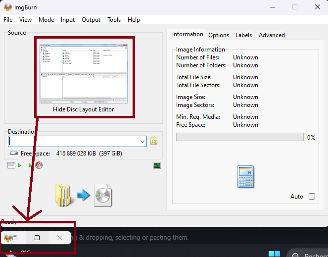
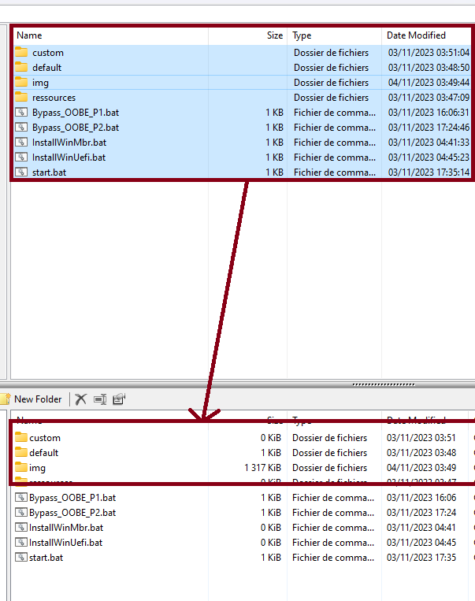

# Creating Iso on Windows

## Get Started

Let's keep it simple.

- We'll download [ImgBurn](https://www.imgburn.com/index.php?act=download), an image burner.

With the graphical interface, it's pretty straightforward.

- We're going to download the scripts in this folder and burn them as iso files.

Check the "Essential_Files.zip" [releases](https://www.imgburn.com/index.php?act=download) to avoid downloading the entire repo.

- Once ImgBurn has been installed on your machine, you can run it and select `Create Image file From files / folders`
- Select the entire folder as the source of the files to be burned.

**Update**
 - Some versions of ImgBurn may have changed.

  
  
  - Drag and drop from the top folder containing the script files to the bat folder, which will update the tree on the left.

  

- Choose a destination path for the iso, then click the "Build" button from the folder to the disk.

- Accept everything and take the default settings.

Your iso is ready, you can go and see the scripts by mounting the output iso.
