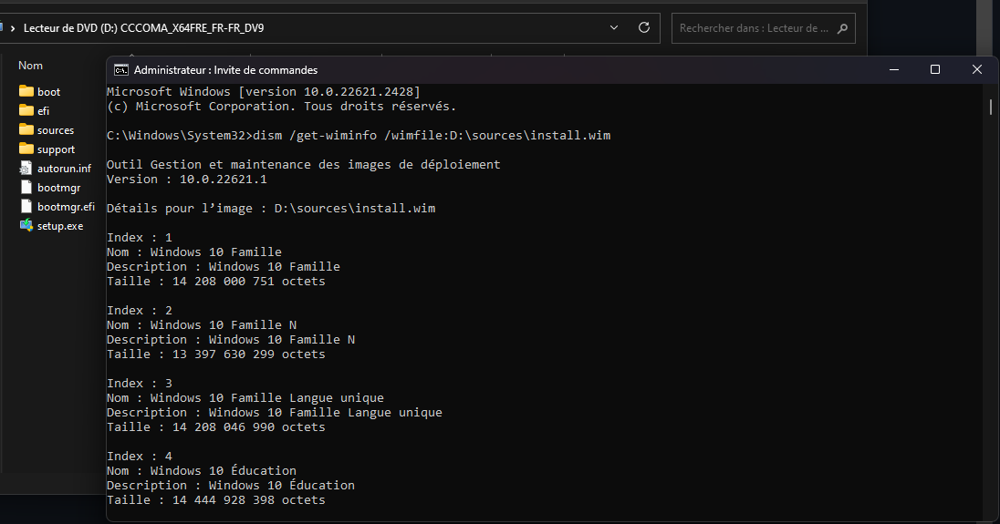
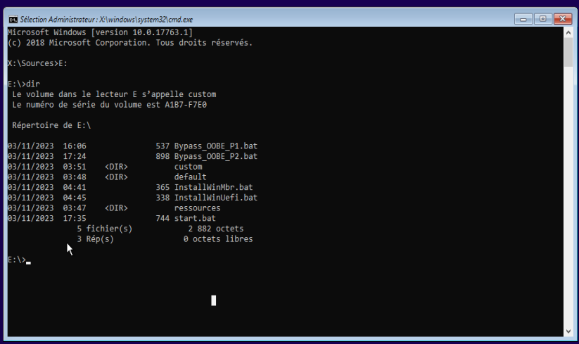
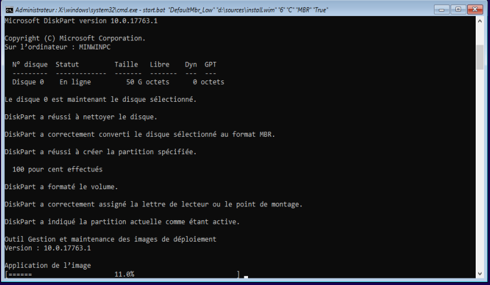
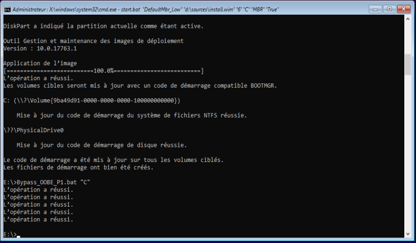
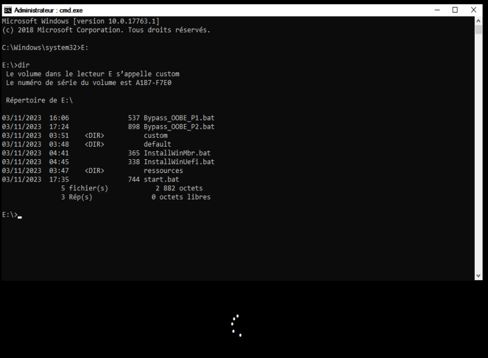
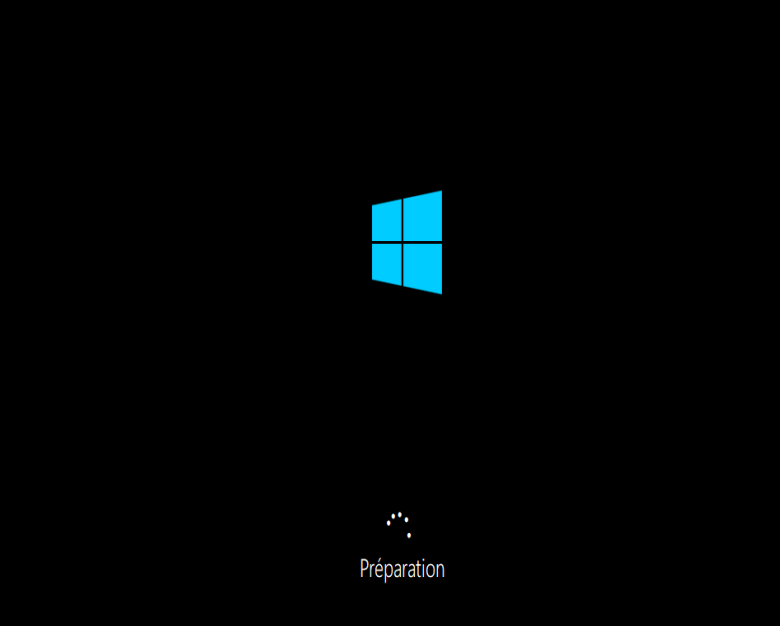
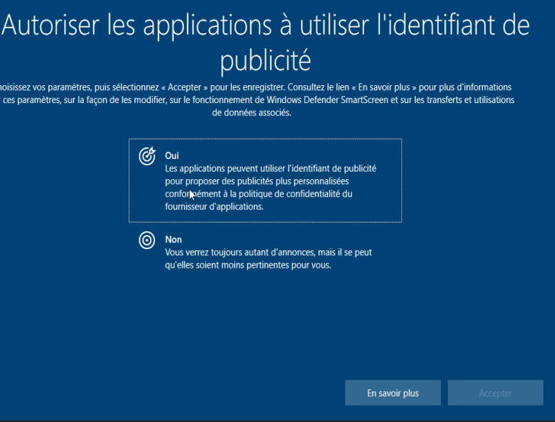
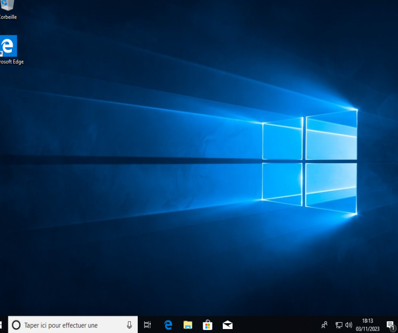

# Automatic Install Windows 10

Install Windows 10 automatically. 

Scripts that can be compiled into an iso, to be launched on the Windows installation screen

### Quick explanation: 


These are scripts in `.bat` format
You'll be able to install Windows with virtually complete automation.

A considerable time-saver for all VM players and test administrators.

We'll add a Windows 10 image to the machine, then add our image to access the script at the same time as the Windows 10 image.

You'll need to compile them into an `.iso` and either mount it or burn it (a simple copy on a usb can also work for other uses).

Don't worry, there'll be a tutorial on how to compile them in `.iso`.

We'll clean and convert the disk to mbr or gpt, then install the windows image which is in a second `.iso` mounted on the machine to be installed, and finally we'll be able to pass on a large part of the user and hardware configuration.


## Get Started

**For a quick configuration without custom disk formats or partitions, please ignore the commands between (optionnal)(/optionnal)**


### *Configure Diskpart*
(optionnal)


(/optionnal)

### *Create a iso file*
(optionnal)


(/optionnal)


### *Prepare*
Look at how many versions (Pro, Family, Enterprise) are available in the chosen iso.

- We'll mount the iso on the main machine (not the installation machine) and launch a terminal, using the following command: 

```
dism /get-wiminfo /wimfile:[Location to install.wim]

dism /get-wiminfo /wimfile:D:\sources\install.wim
```


Note the index of the version you want.

In this case, I want the professional version, so I'll use index 6.


### *Start*
- Insert the images of Windows 10 and the downloaded or burned image into the machine to be installed.

You end up with, for example 
*D:\Windows (D: is the drive for the Windows 10 iso) and E:\start.bat (E: is the drive for our script iso)*

- On the Windows installation page, press Shift+F10.

This will open the administrator cmd of the fictitious Windows10 iso partition.

You'll find the drive containing the installation scripts


We'll run the command to convert the disk and install Windows 10 directly.
The custom folder contains a basic "DefaultMbr_Low" file.
It will convert Disk 0 to MBR and assign it the letter C and the label "Windows".

(optionnal)
If you created the diskpart file yourself, replace "DefaultMbr_Low" with the name of your file in ./custom.
(/optionnal)

```
[Letter of iso script]:
start.bat <Custom Diskpart> <Path Install.wim> <Index> <ApplyLetterPart> <Format> <Bypass_OOBE>

E:
start.bat "DiskpartMbr_Low" "d:\sources\install.wim" "6" "C" "MBR" "True"
```


This may take a while depending on your configuration (2 minutes with 8 GB ram for me).

**At the end of the script, if you want to bypass the OOBE used to configure network connections, user accounts and matteriel configuration during the first installation, you'll only have to configure the services manually.**
```
Bypass_OOBE_P1.bat <ApplyLetterPart>

Bypass_OOBE_P1.bat "C"
```


Finally, reboot the machine with the wpeutil utility.

**The installation is now complete, and you can configure the end of Windows as usual.**

*If you've chosen the OOBE bypass, you're not done yet.*
- Once the machine has rebooted, initialization will lock up and open a shell, so we'll end the configuration with the following command: 
```
[Letter of iso script]:
Bypass_OOBE_P2.bat <ApplyLetterPart> <Recovery Part> <AdminName> <AdminPass> <GroupAdmin> <GroupUser>

E:
Bypass_OOBE_P1.bat "C" "False" "user" "user" "Administrators" "Users"
```


**It is unfortunately necessary to specify the admin and user groups, because depending on the language chosen, the group labels can be very different.**

**The script will end with a black screen and the machine will restart, you will be asked for the password, and the last service configuration can be performed. **





### Credits:
The repo that inspired all this, many thanks.

https://gist.github.com/Alee14/e8ce6306a038902df6e7a6d667544ac9
